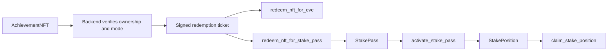
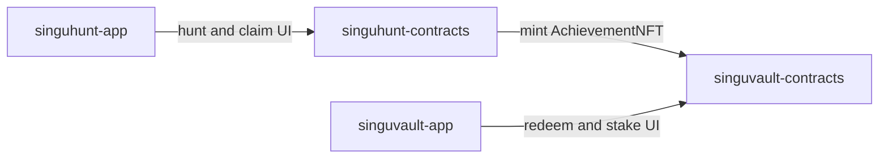

# Singu Vault Contracts

Sui Move contracts for the Singu Vault reward flow.

This repository is the on-chain backend for Singu Vault. It verifies backend-signed redemption tickets referencing Singu Hunt `AchievementNFT` object IDs (the NFT itself is not consumed or transferred by this contract) and routes the player into one of two outcomes:

1. immediate `EVE` redemption
2. stake-pass issuance, followed by locked staking and later claim

No production links are included in this README.

## English

### What This Package Does

- prevents the same achievement NFT from being redeemed twice
- verifies backend-issued signed tickets on-chain
- redeems achievements into `EVE`
- issues `StakePass` objects with per-mode requirements
- locks `SUI + USDC` through `activate_stake_pass<USDC>`
- returns principal and mints `EULM` through `claim_stake_position<USDC>`

### Repository Layout

`move-contracts/singuvault/sources/eve.move`
Immediate reward coin module.

`move-contracts/singuvault/sources/eulm.move`
Reward coin used for the locked-position claim path.

`move-contracts/singuvault/sources/vault.move`
Core shared state, replay protection, redemption, stake-pass issuance, activation, and claim.

`move-contracts/singuvault/sources/sig_verify.move`
Signature verification helpers for redemption tickets.

### Main Objects

`VaultState`
Shared vault object holding treasury caps, counters, ticket signer address, redeemed NFT tracking, and used-ticket replay protection.

`AdminCap`
Admin capability used to configure privileged settings.

`StakePass`
Access object minted from an NFT redemption. Stores mode, minimum `SUI`, minimum `USDC`, `EULM` reward amount, and lock duration.

`StakePosition<USDC>`
Locked position minted when a pass is activated with `SUI + USDC`.

### Main Functions

`initialize`
Creates the shared vault and transfers the admin cap to the publisher.

`set_ticket_signer`
Sets the signer address expected by the redemption-ticket validation flow.

`redeem_nft_for_eve`
Consumes a valid ticket and redeems the NFT into the immediate reward path.

`redeem_nft_for_stake_pass`
Consumes a valid ticket and mints a `StakePass` instead of paying the immediate reward.

`activate_stake_pass<USDC>`
Consumes a `StakePass`, locks the supplied coins, and creates a `StakePosition<USDC>`.

`claim_stake_position<USDC>`
After unlock, returns principal and mints `EULM`.

### View Functions

`total_nfts_redeemed` `total_eve_minted` `total_eulm_minted` `total_passes_issued` `total_positions`
Counters exposed for frontend or indexer consumption.

`is_nft_redeemed`
Returns whether a given NFT object ID has already been redeemed.

### Contract Flow

```text
Singu Hunt AchievementNFT
  -> backend verifies ownership and mode
  -> backend signs redemption ticket
  -> player calls redeem_nft_for_eve()
     or
  -> player calls redeem_nft_for_stake_pass()
  -> player calls activate_stake_pass<USDC>()
  -> player calls claim_stake_position<USDC>()
```



### Frontend / App Relationship

- `singuhunt-contracts`
  Mints the `AchievementNFT` redeemed here.
- `singuhunt-app`
  Player-facing hunt frontend that drives registration, gameplay, and achievement claim.
- `singuvault-app`
  Player-facing vault frontend and API layer for redeem / stake / claim flows.



### Current App-Side Config Surface

The current `singuvault-app` expects env / config values for:

- `VITE_VAULT_STATE_ID`
- `VITE_SINGUVAULT_PACKAGE_ID`
- `VITE_SUI_RPC_URL`
- `VITE_REDEEM_API_URL`
- `VITE_EVE_COIN_TYPE`
- `VITE_USDC_COIN_TYPE`

If the package is republished or the shared vault object is re-initialized, the frontend must be updated to match the new package ID and state object ID.

### Build And Publish

The current `Move.toml` has an empty `[dependencies]` section. If building from a fresh clone, you may need to restore the Sui framework dependency (e.g. `Sui = { git = "https://github.com/MystenLabs/sui.git", subdir = "crates/sui-framework/packages/sui-framework", rev = "testnet-v1.66.2" }`).

```bash
cd move-contracts/singuvault
sui move build
sui client publish --gas-budget 200000000
```

After publish:

```bash
sui client call \
  --package <PACKAGE_ID> \
  --module vault \
  --function initialize \
  --args <EVE_TREASURY_CAP_ID> <EULM_TREASURY_CAP_ID>
```

Then configure the backend signer:

```bash
sui client call \
  --package <PACKAGE_ID> \
  --module vault \
  --function set_ticket_signer \
  --args <ADMIN_CAP_ID> <VAULT_STATE_ID> <SIGNER_ADDRESS>
```

### Runtime Notes

- `VaultState` tracks redeemed NFTs and used tickets separately.
- `activate_stake_pass<USDC>` creates the `USDC` dynamic-field pool lazily on first use.
- `claim_stake_position<USDC>` destroys the position object and decrements the active position count.

## 中文

### 這個合約包現在負責什麼

- 防止同一張 Achievement NFT 被重複兌換
- 在鏈上驗證後端簽發的 redemption ticket
- 將 Achievement 直接兌換成 `EVE`
- 根據模式發放 `StakePass`
- 透過 `activate_stake_pass<USDC>` 鎖定 `SUI + USDC`
- 透過 `claim_stake_position<USDC>` 返還本金並發放 `EULM`

### 目前主要模組

`eve.move`
立即兌換路徑使用的代幣模組。

`eulm.move`
鎖倉完成後 claim 的獎勵代幣模組。

`vault.move`
核心 Vault 共享狀態、票據驗證、NFT 兌換、StakePass 發放、啟動質押與 claim。

`sig_verify.move`
票據簽章驗證工具。

### 主要物件

`VaultState`
共享 Vault 物件，保存 treasury cap、計數器、簽名者地址、已兌換 NFT 與已使用 ticket。

`AdminCap`
管理員能力物件，用於設定 signer 等高權限操作。

`StakePass`
從 Achievement NFT 兌換而來的資格物件，保存最低 `SUI`、最低 `USDC`、`EULM` 獎勵與鎖定時間。

`StakePosition<USDC>`
實際鎖定後生成的倉位物件。

### 與前端倉庫的關係

- `singuhunt-contracts`
  產生會被此處兌換的 `AchievementNFT`
- `singuhunt-app`
  玩家遊戲前端，負責報名、收集、交付與 claim Achievement
- `singuvault-app`
  玩家兌換與質押前端，會呼叫本倉庫暴露的核心函式

### 前端部署時要對齊的設定

如果重新部署 package 或重建 vault，至少要同步更新 `singuvault-app` 的：

- `VITE_SINGUVAULT_PACKAGE_ID`
- `VITE_VAULT_STATE_ID`
- `VITE_SUI_RPC_URL`
- `VITE_EVE_COIN_TYPE`
- `VITE_USDC_COIN_TYPE`
- `VITE_REDEEM_API_URL`

### 部署流程

```bash
cd move-contracts/singuvault
sui move build
sui client publish --gas-budget 200000000
```

如果從全新 clone 編譯，可能需要在 `Move.toml` 的 `[dependencies]` 補上 Sui framework 依賴。

發佈後先 `initialize`，再 `set_ticket_signer`。

## License

Copyright (c) Eve U Luv Me. All rights reserved.

This repository is proprietary and is not licensed under MIT.
